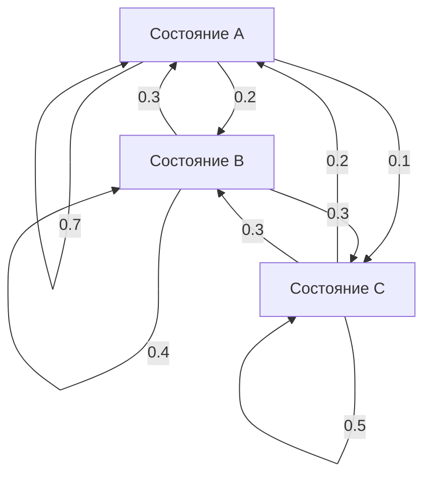

# Вероятностная модель процесса. Примеры.

Вероятностные модели процессов используются для описания случайных явлений в различных областях, таких как физика, биология, экономика и инженерия. Эти модели помогают понять, предсказать и анализировать поведение систем, подверженных случайным воздействиям. Рассмотрим несколько примеров вероятностных моделей процессов.

### Примеры вероятностных моделей процессов

1. **Процесс Пуассона**

Процесс Пуассона моделирует количество событий, происходящих в фиксированный интервал времени или пространства. Этот процесс характеризуется следующими свойствами:
- События происходят независимо.
- Вероятность одного события в малом интервале времени пропорциональна длине интервала.
- Вероятность более одного события в малом интервале времени стремится к нулю.

Формула для вероятности наблюдения $k$ событий за время $t$ при интенсивности $\lambda$:

$P(N(t) = k) = \frac{(\lambda t)^k e^{-\lambda t}}{k!}$

**Пример:**
- Число звонков, поступающих в колл-центр за час.

2. **Марковские процессы**

Марковский процесс — это процесс, в котором будущее состояние системы зависит только от её текущего состояния и не зависит от предшествующих состояний. Такие процессы характеризуются "свойством Маркова".


**Пример:**
- Модель простого случайного блуждания: в каждый момент времени частица перемещается на одну единицу вправо или влево с равной вероятностью.

3. **Линейный гауссовский процесс ([[Фильтр Калмана. Расширенный фильтр Калмана.|фильтр Калмана]])**

Линейный гауссовский процесс используется для оценки состояния системы, где наблюдения и состояния имеют нормальное [[Распределение случайной величины|распределение]], и система описывается линейными уравнениями. 

**Пример:**
- [[Фильтр Калмана. Расширенный фильтр Калмана.|фильтр Калмана]] используется в системах навигации для оценки положения и скорости объекта на основе наблюдений.

4. **Модели регрессии**

Регрессионные модели используются для установления зависимости между переменными. В вероятностных моделях регрессии предполагается наличие случайных ошибок, влияющих на зависимую переменную.

**Пример:**
- Линейная регрессия: зависимость веса человека от его роста, где вес является зависимой переменной, а рост — независимой. Модель включает случайную ошибку, которая учитывает отклонения.

5. **Процесс Броуна (Броуновское движение)**

Процесс Броуна используется для моделирования случайных движений частиц в жидкости или газе. Это непрерывный случайный процесс с независимыми и нормальными приращениями.

**Пример:**
- Моделирование движения частиц пыли в воздухе или движения молекул в жидкости.

6. **Модели обслуживания (теория очередей)**

Модели теории очередей анализируют процессы обслуживания клиентов в системах с ограниченными ресурсами.

**Пример:**
- Модель M/M/1: одна очередь и один сервер, где поступление клиентов описывается процессом Пуассона, а время обслуживания имеет экспоненциальное [[Распределение случайной величины|распределение]].

### Детальный пример: Процесс Пуассона

Рассмотрим детальный пример использования процесса Пуассона для моделирования поступления звонков в колл-центр.

**Описание задачи:**
- Колл-центр получает в среднем 10 звонков в час.

**Модель:**
- Пусть $\lambda = 10$ звонков в час.
- Вероятность того, что за час поступит ровно $k$ звонков, определяется по формуле Пуассона:
  $P(N(1) = k) = \frac{10^k e^{-10}}{k!}$

**Пример вычисления:**
- Вероятность того, что за час поступит ровно 5 звонков:
  $P(N(1) = 5) = \frac{10^5 e^{-10}}{5!} = \frac{100000 e^{-10}}{120} \approx 0.037$

### Пример на Python

Давайте напишем код для модели Марковского процесса, примененного к роботу, с использованием объектно-ориентированного подхода и принципов Clean Code. Мы также добавим диаграмму Mermaid для визуализации процесса.

### Код на Python

```python
import numpy as np

class MarkovRobot:
    def __init__(self, states, initial_probabilities, transition_matrix):
        """
        Инициализация робота с использованием Макровского процесса.
        
        :param states: список состояний
        :param initial_probabilities: начальные вероятности состояний (np.array)
        :param transition_matrix: матрица переходов (np.array)
        """
        self.states = states
        self.probabilities = initial_probabilities
        self.transition_matrix = transition_matrix

    def step(self):
        """
        Выполнение одного шага Макровского процесса.
        """
        self.probabilities = self.probabilities @ self.transition_matrix
        self.normalize_probabilities()

    def normalize_probabilities(self):
        """
        Нормализация вероятностей состояний.
        """
        self.probabilities /= np.sum(self.probabilities)

    def get_state_probabilities(self):
        """
        Получение текущих вероятностей состояний.
        
        :return: текущие вероятности состояний (np.array)
        """
        return self.probabilities

    def get_most_likely_state(self):
        """
        Получение наиболее вероятного состояния.
        
        :return: наименование наиболее вероятного состояния
        """
        max_index = np.argmax(self.probabilities)
        return self.states[max_index]

# Пример использования

if __name__ == "__main__":
    # Определение состояний
    states = ["A", "B", "C"]

    # Начальные вероятности состояний
    initial_probabilities = np.array([0.5, 0.3, 0.2])

    # Матрица переходов
    transition_matrix = np.array([
        [0.7, 0.2, 0.1],
        [0.3, 0.4, 0.3],
        [0.2, 0.3, 0.5]
    ])

    # Создание объекта робота с Макровским процессом
    robot = MarkovRobot(states, initial_probabilities, transition_matrix)

    # Выполнение шагов
    for step in range(5):
        robot.step()
        print(f"Шаг {step + 1}: {robot.get_state_probabilities()}")

    # Наиболее вероятное состояние
    print(f"Наиболее вероятное состояние: {robot.get_most_likely_state()}")
```

### Диаграмма Mermaid



### Объяснение

1. **Класс `MarkovRobot`**: Этот класс моделирует робота, используя Макровский процесс.
   - `__init__` метод инициализирует состояния, начальные вероятности и матрицу переходов.
   - `step` метод обновляет вероятности состояний на основе матрицы переходов.
   - `normalize_probabilities` метод нормализует вероятности состояний.
   - `get_state_probabilities` метод возвращает текущие вероятности состояний.
   - `get_most_likely_state` метод возвращает наиболее вероятное состояние.

2. **Пример использования**: Инициализация робота с определенными состояниями, вероятностями и матрицей переходов. Выполнение нескольких шагов процесса и вывод вероятностей состояний после каждого шага, а также наиболее вероятного состояния.

3. **Диаграмма Mermaid**: Диаграмма визуализирует состояния и вероятности переходов между ними. Например, из состояния `A` вероятность остаться в `A` составляет 0.7, перейти в `B` - 0.2, и в `C` - 0.1.

Этот код и диаграмма помогают понять, как моделировать поведение робота с использованием Макровского процесса и как вероятности состояний изменяются с каждым шагом.
### Вывод

Вероятностные модели процессов предоставляют мощный инструментарий для анализа и прогнозирования поведения случайных систем. Каждая из описанных моделей находит применение в реальных задачах и помогает принимать обоснованные решения в условиях неопределённости.